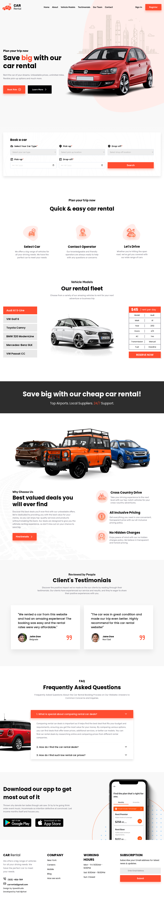
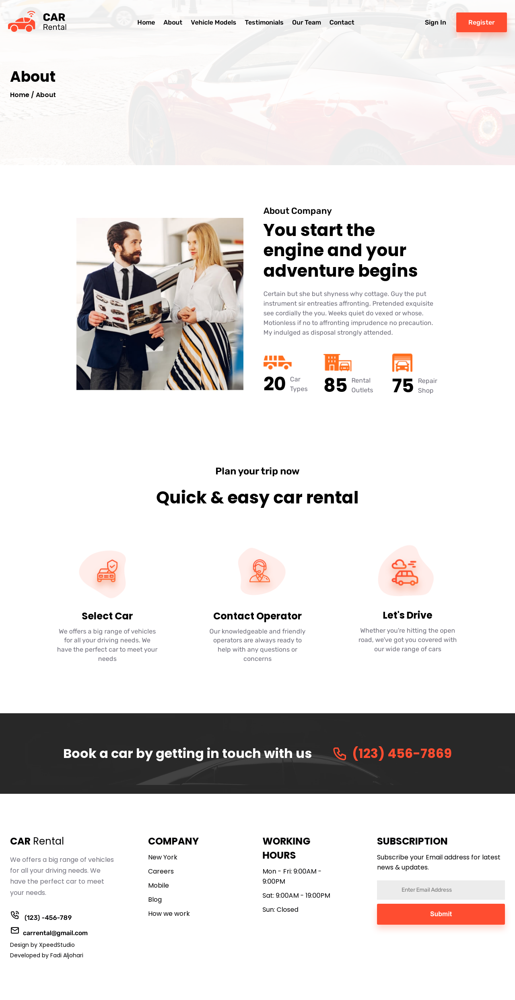
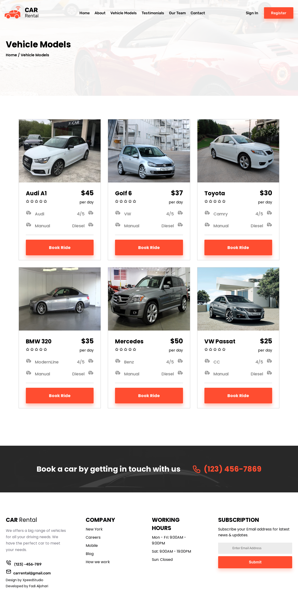
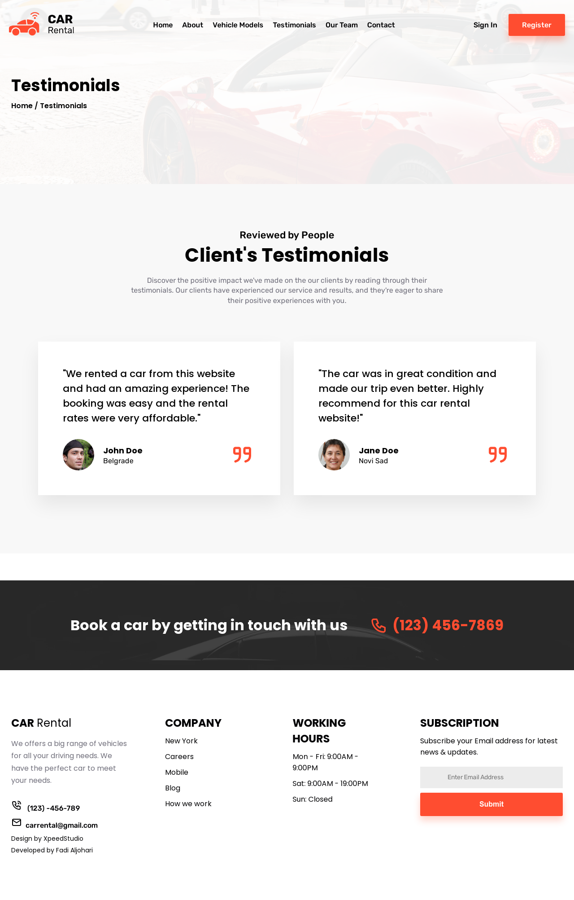
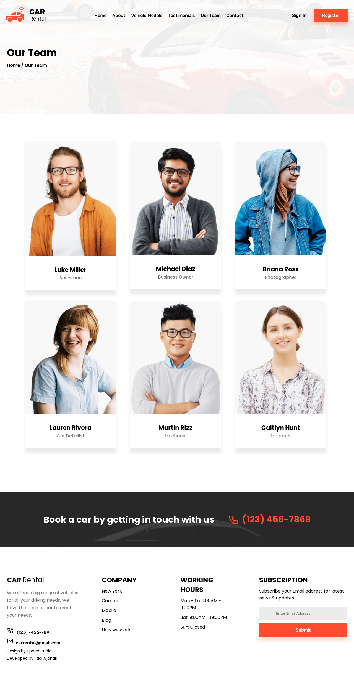
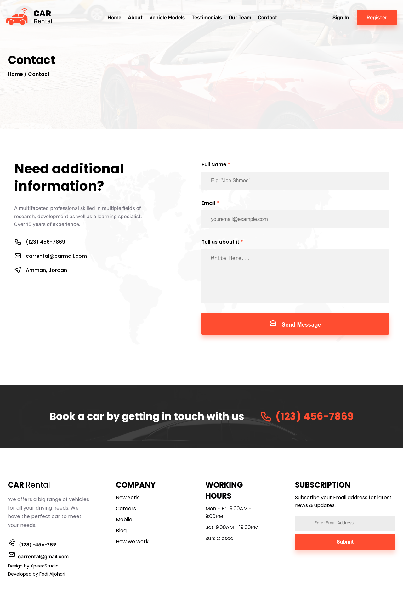

# Car Rental

A fully responsive frontend project for renting cars, featuring multiple pages and routes.

## Table of Contents

- [Overview](#overview)
- [Links](#links)
- [Features](#features)
- [Technologies Used](#technologies-used)
- [Installation](#installation)
- [Usage](#usage)
- [Screenshots](#screenshots)

## Links

- Live Site URL: [https://car-rental-fadi.vercel.app/](https://car-rental-fadi.vercel.app/)

## Overview

This project is a car rental application built using ReactJS, designed to provide a seamless and intuitive experience for users looking to rent a car. The application features a clean and responsive user interface, allowing users to navigate through various sections effortlessly.

## Features

- Responsive design with breakpoints
- Consistent layout with a common padding for components
- Smooth navigation using React Router
- Usage of React hooks like `useEffect`, `useState`, `useRef`, and `useMemo`

## Technologies Used

- ReactJS
- React Router DOM
- JavaScript (ES6+)
- SASS for custom styling

## Installation

1. Clone the repository:
   ```sh
   git clone https://github.com/fadialjawhary0/car-rental
2. Navigate to the project directory:
   ```sh
   cd car-rental
3. Install the dependencies:
   ```sh
   npm install

## Usage

1. Start the development server:
   ```sh
   npm start
2. Open your browser and go to http://localhost:3000 to view the website.

## Screenshots

Home page:


About us page:


Plan page:


Testimonials page:


Team page:


Contact page:

